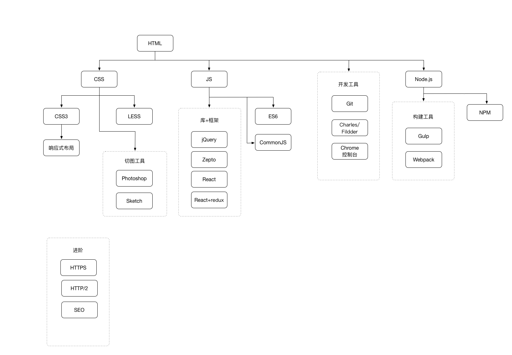

# 基础技能

- HTML(5)
- CSS(3)
- JS

# 必备技能

- Photoshop
- jQuery
- Zepto
- React
- CommonJS
- Git
- 抓包(Charles/Fildder)
- Chrome控制台

# 扩展技能
- ES6
- React+redux
- Sketch
- Node.js
- Gulp
- Webpack
- SEO

# 进阶技能
- HTTPS
- HTTP/2